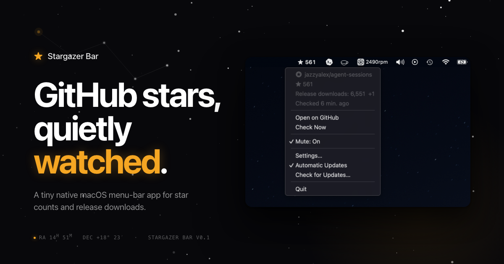
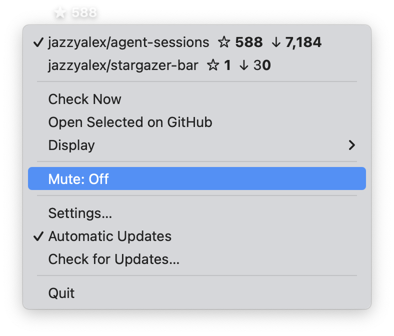

<div align="center">



<h1>Stargazer Bar</h1>

<p>
  <strong>GitHub stars in your macOS menu bar.</strong><br>
  A tiny native app for watching multiple public repositories' stars and<br>
  release downloads without keeping GitHub open.
</p>

<p>
  <a href="https://github.com/jazzyalex/stargazer-bar/releases/latest"></a>
  <a href="LICENSE"></a>
  
  <a href="https://github.com/jazzyalex/homebrew-stargazer-bar"></a>
</p>

<p>
  <a href="https://github.com/jazzyalex/stargazer-bar/releases/latest"><b>Download</b></a>
  &nbsp;·&nbsp;
  <a href="https://jazzyalex.github.io/stargazer-bar/"><b>Website</b></a>
  &nbsp;·&nbsp;
  <a href="https://github.com/jazzyalex/stargazer-bar/issues"><b>Issues</b></a>
</p>

</div>

---

Stargazer Bar is an open-source macOS GitHub stars menu bar app for maintainers who want lightweight launch or release telemetry across public repositories. It works as a small GitHub release download counter too: stars stay in the menu bar, release downloads live in the dropdown, and the app reads GitHub directly without a backend.

## Install

**Homebrew** *(recommended)*

```bash
brew install --cask jazzyalex/stargazer-bar/stargazer-bar
```

**Direct download**

Grab the signed, notarized Apple silicon DMG from the [latest release](https://github.com/jazzyalex/stargazer-bar/releases/latest).

## Features

- ⭐ &nbsp;Live star counts for multiple public repos in your menu bar — no browser tab required
- 📦 &nbsp;Release download totals from GitHub's latest releases API page (up to 100 releases)
- 📈 &nbsp;Per-repo star and fork trend charts directly in the menu
- 🖼️ &nbsp;Copy milestone text or a square share image when a repo passes a rounded download/star mark
- 🔔 &nbsp;Per-repository star sounds, so each tracked project can have its own update cue
- 🔑 &nbsp;Track any public repo manually without a GitHub account; sign-in only powers the repo picker
- 🔄 &nbsp;Sparkle auto-updates, EdDSA-signed and notarized
- 🔒 &nbsp;Private by default — no backend, no telemetry, Keychain-stored tokens
- 🪶 &nbsp;Native Apple silicon app, designed to stay out of the way

<div align="center">
  
</div>

## Privacy

The app stores tracked repository metadata and settings locally in `UserDefaults`. Optional GitHub OAuth tokens are stored in Keychain. There is **no backend and no telemetry**. The only non-GitHub network activity is optional Sparkle update checking.

## Build from source

```bash
xcodebuild -project GHMenuStars.xcodeproj -scheme GHMenuStars -configuration Debug build
xcodebuild -project GHMenuStars.xcodeproj -scheme GHMenuStars -configuration Debug \
  -destination 'platform=macOS,arch=arm64' test
```

The **Connect GitHub** feature uses GitHub's OAuth device flow. Manual repository tracking works without credentials; the signed-in repository picker requires a GitHub OAuth app client id.

For local builds, copy `Config/Local.xcconfig.example` to `Config/Local.xcconfig` and set `GHMENUSTARS_GITHUB_OAUTH_CLIENT_ID`. The local config file is gitignored. You can also pass `GHMENUSTARS_GITHUB_OAUTH_CLIENT_ID=...` to `xcodebuild`, or launch with `GH_MENU_STARS_GITHUB_CLIENT_ID=...` for one-off debugging.

<details>
<summary><b>Release &amp; deploy</b></summary>

<br>

Stargazer Bar uses Sparkle 2 for signed automatic updates. The production appcast is published at:

```
https://jazzyalex.github.io/stargazer-bar/appcast.xml
```

The release helper builds the Release app, signs with Developer ID, notarizes and staples the app and DMG, generates a Sparkle EdDSA-signed appcast for the zipped archive (release notes from `docs/CHANGELOG.md`), creates or updates the GitHub release, commits the appcast, verifies the public release, and updates the Homebrew cask tap:

```bash
VERSION=0.2 tools/release/deploy-stargazer-bar.sh
tools/release/verify-deployment.sh 0.2
```

The script expects `gh` authentication, a Developer ID Application certificate, notary credentials, and the Sparkle EdDSA private key in Keychain. `tools/release/.env` may provide `TEAM_ID`, `DEV_ID_APP`, `NOTARY_KEY_PATH`, `NOTARY_KEY_ID`, `NOTARY_ISSUER`, or `SPARKLE_ED_KEY_FILE`.

Homebrew tap settings:

```bash
UPDATE_CASK=1
CASK_REPO=jazzyalex/homebrew-stargazer-bar
```

To test the full local release path without publishing or modifying `docs/appcast.xml`:

```bash
VERSION=0.2 tools/release/test-release-path.sh
```

This builds the Release app, signs with Developer ID, packages a DMG and Sparkle ZIP, checksums them, renders release notes, and generates a signed Sparkle appcast under `dist/release-path-test`. It notarizes when credentials are configured; set `REQUIRE_NOTARY=1` to fail the test if notarization is unavailable.

</details>

## License

[BSD 3-Clause](LICENSE) · See [Third-Party Notices](ThirdPartyNotices.md)

<div align="center">
  <sub>Made with care for people who like their tools small and quiet. If it helps, a GitHub star helps others find it.</sub>
</div>
