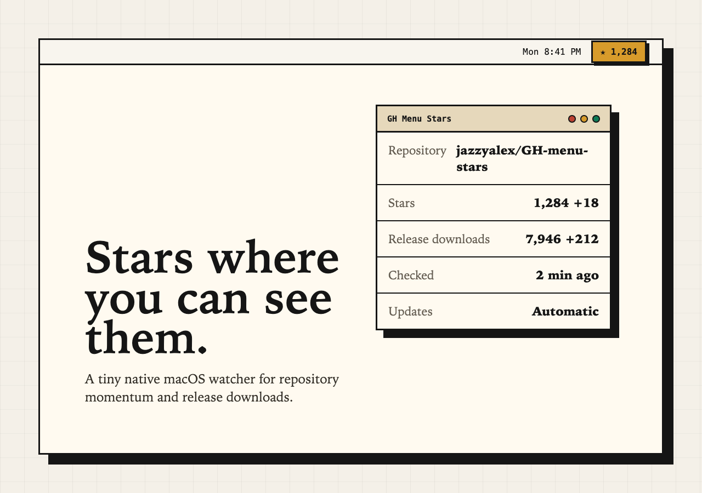
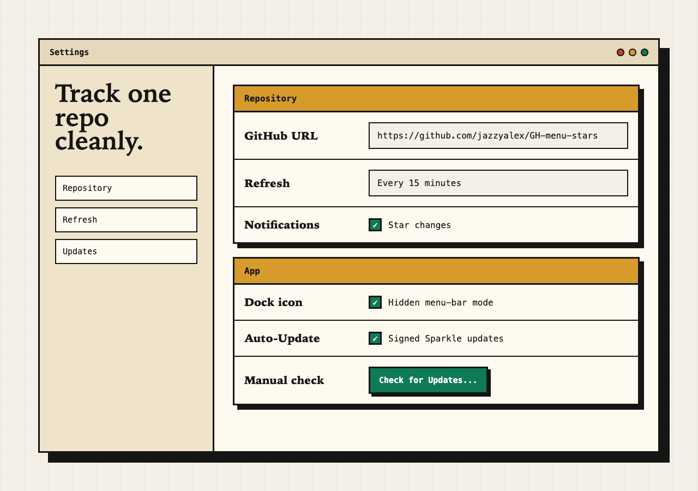

# GH Menu Stars

GH Menu Stars is a native macOS menu-bar app for watching a GitHub repository without keeping a browser tab open. It shows the current star count in the menu bar, tracks changes between refreshes, and includes release-download totals from the latest 100 releases in the dropdown.



## Install

### Homebrew

```bash
brew tap jazzyalex/gh-menu-stars
brew install --cask gh-menu-stars
```

### Direct Download

Download the latest signed and notarized Apple silicon DMG from:

```text
https://github.com/jazzyalex/GH-menu-stars/releases/latest
```

## Features

- Menu-bar star counter for one public GitHub repository.
- Release-download total from the latest 100 releases.
- Local change detection and optional macOS notifications.
- Manual repository entry with no GitHub login required.
- Optional GitHub OAuth device flow for browsing public repositories available to the signed-in user.
- Sparkle automatic updates, signed with EdDSA and enabled by default.
- Apple silicon build for macOS Ventura or later.
- Local-only settings storage, with optional OAuth tokens stored in Keychain.



## Build

```bash
xcodebuild -project GHMenuStars.xcodeproj -scheme GHMenuStars -configuration Debug build
xcodebuild -project GHMenuStars.xcodeproj -scheme GHMenuStars -configuration Debug -destination 'platform=macOS,arch=arm64' test
```

`Connect GitHub` uses GitHub's OAuth device flow. Manual repository tracking works without credentials, but the signed-in repository picker requires a registered GitHub OAuth app client id.

For local builds, copy `Config/Local.xcconfig.example` to `Config/Local.xcconfig` and set `GHMENUSTARS_GITHUB_OAUTH_CLIENT_ID`. The local config file is ignored by git. You can also pass `GHMENUSTARS_GITHUB_OAUTH_CLIENT_ID=...` to `xcodebuild`, or launch with `GH_MENU_STARS_GITHUB_CLIENT_ID=...` for one-off debugging.

## Release

GH Menu Stars uses Sparkle 2 for signed automatic updates. The production appcast is published from `docs/appcast.xml` to:

```text
https://jazzyalex.github.io/GH-menu-stars/appcast.xml
```

The release helper builds the Release app, signs with Developer ID, notarizes and staples the app and DMG, generates a Sparkle EdDSA-signed appcast for the zipped app archive with release notes from `docs/CHANGELOG.md`, creates or updates the GitHub release, commits the appcast, verifies the public release, and updates the Homebrew cask tap:

```bash
VERSION=0.1.0 tools/release/deploy-gh-menu-stars.sh
tools/release/verify-deployment.sh 0.1.0
```

The script expects `gh` authentication, a Developer ID Application certificate, notary credentials, and the Sparkle EdDSA private key in Keychain. `tools/release/.env` may provide `TEAM_ID`, `DEV_ID_APP`, `NOTARY_KEY_PATH`, `NOTARY_KEY_ID`, `NOTARY_ISSUER`, or `SPARKLE_ED_KEY_FILE`.

Homebrew tap settings:

```bash
UPDATE_CASK=1
CASK_REPO=jazzyalex/homebrew-gh-menu-stars
```

To test the full local release path without publishing or modifying `docs/appcast.xml`:

```bash
VERSION=0.1.0 tools/release/test-release-path.sh
```

This builds the Release app, signs with Developer ID, packages a DMG and Sparkle ZIP, checksums them, renders release notes, and generates a signed Sparkle appcast under `dist/release-path-test`. It notarizes when credentials are configured; set `REQUIRE_NOTARY=1` to fail the test if notarization is unavailable.

## Privacy

The app stores tracked repository metadata and settings locally in `UserDefaults`. Optional GitHub OAuth tokens are stored in Keychain. The app has no backend and no telemetry. The only non-GitHub network activity is optional Sparkle update checking when updates are enabled.
